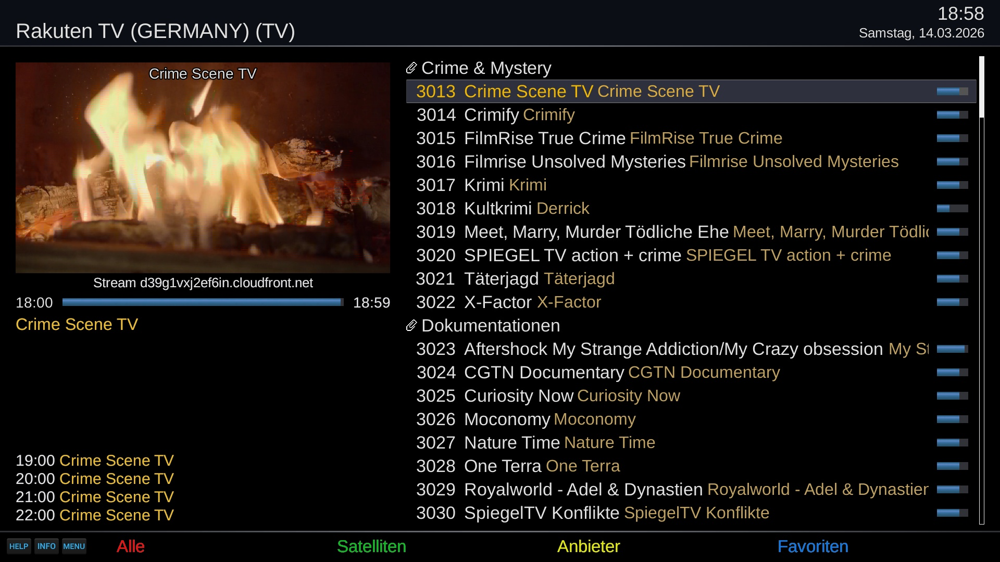

# Rakuten TV (RTV)
Open-Enigma2 plugin for Live-TV streams

## Live-TV

## Video-On-Demand
Rakuten TV offers Video-On-Demand but requires Widevine for playback

## Features
- Playback of Rakuten TV channels by country
- Live TV bouquet creation with EPG support
- Picon (channel icon) management

## Supported Regions
- Austria
- Switzerland
- Germany
- Denmark
- Spain
- Finland
- France
- Ireland
- Italy
- Netherlands
- Norway
- Poland
- Romania
- Sweden
- United Kingdom
- United States

## Limitations
- Rakuten TV supports OpenViX and compatible Open Enigma2 distributions.
- Skin is optimized for Simple_Ten_Eighty system skin.

## Languages
- english
- german

## Links
- Installation: https://opencockpit.github.io/RakutenTV
